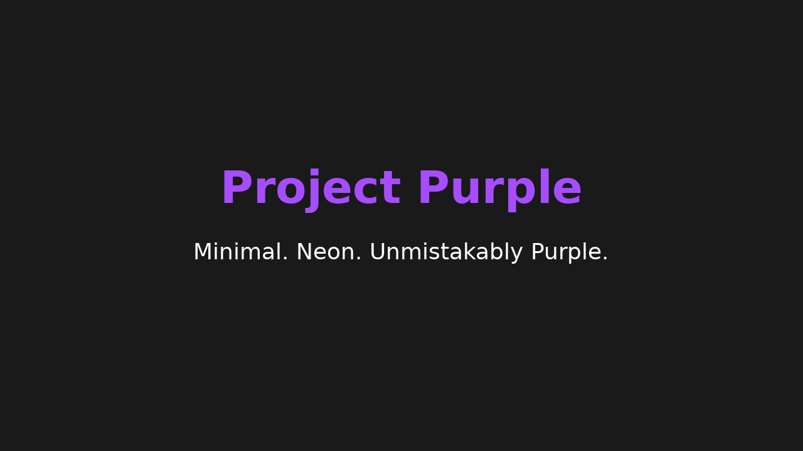

# Project Purple — KDE Plasma Global Theme (v1.0)

**Minimal. Neon. Unmistakably Purple.**  
A sleek, high-contrast KDE Plasma theme designed for developers and power users who love a futuristic yet simple desktop.

---

## 📸 Preview


---

## ✨ Features
- **Full KDE Plasma Global Theme**
- Matching **cursor pack** with hover glow
- Minimal neon purple accents on a dark UI
- **Rounded panels** for a modern touch
- Custom **wallpaper** with subtle nebula details
- **High-contrast** off-white text for readability
- Lightweight & performance-friendly

---

## 📦 Installation (User Scope)

```bash
# 1. Unpack the theme into your local Plasma themes directory
unzip ProjectPurple_GlobalTheme_v1_KPackage.zip -d ~/.local/share/plasma/look-and-feel/

# 2. Rebuild Plasma’s theme cache
kbuildsycoca6 --noincremental

# 3. Apply the theme
lookandfeeltool -a org.projectpurple

# Optional: Build the custom cursor (first time only)
sudo dnf install -y xcursorgen
~/.local/share/plasma/look-and-feel/ProjectPurple/contents/cursors/ProjectPurpleCursor/build.sh
```

**Tip:** No system restart is required — just log out and back in.

---

## 💾 Contents
```
ProjectPurple/
 ├── Global Theme (KPackage)
 ├── Cursor Pack
 ├── Wallpaper
 ├── Matching Color Scheme
 ├── README.md
```

---

## 📥 Downloads
- **Latest Release:** [GitHub Releases](https://github.com/YourUsername/ProjectPurple/releases)
- **KDE Store:** *(coming soon)*

---

## 💖 Support & Donations
If you enjoy Project Purple and want to see updates & new features:  
**PayPal:** [jones.lm89@gmail.com](mailto:jones.lm89@gmail.com)

---

## 📝 Changelog
### v1.0
- Initial release
- Global theme, cursor pack, and wallpaper
- Rounded panel style
- Minimal neon purple accent palette

---

## 📜 License
This theme is released under the **GPL-3.0** license.  
You are free to share and modify it under the same license.
